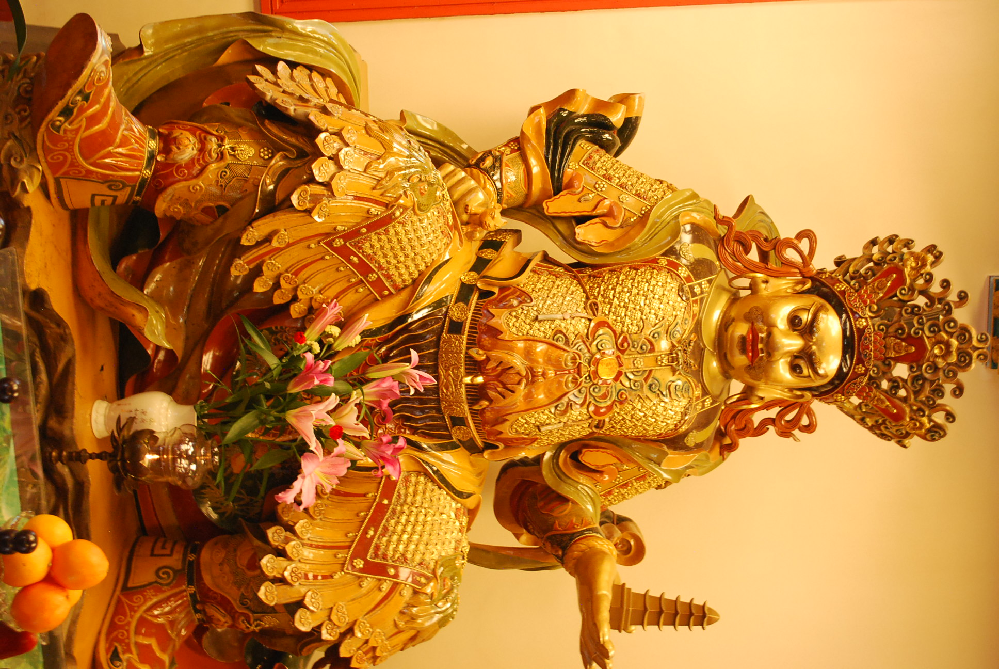
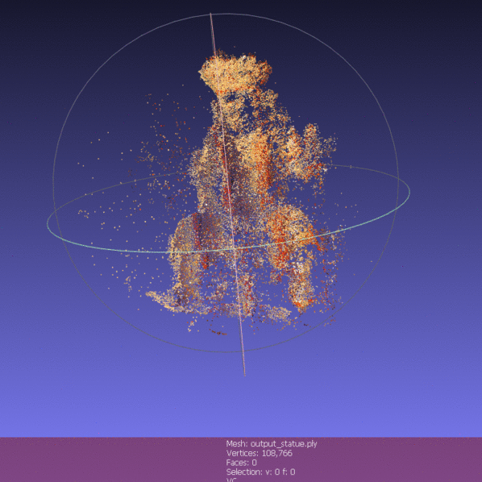

# Structure-from-Motion

The aim was to construct 3D sparse reconstruction of a scene using a set of unordered images.

### Softwares
* Conding was done on Python using the opencv library
* The visualisation was done on MeshLab

### Algorithm
* Extract features between two images using fast features
* Estimate the relative pose of 2nd frame wrt 1.
* Triangulate common features found between two images to obtain 3D point.
* Append the point in a .ply file
* Repeat the above 4 steps for the series of images.

### Dataset
The dataset was taken from [here](https://link-url-here.org)
The calibration matrix for the same can be ontained from the respective data.mat files

* #### Results:

